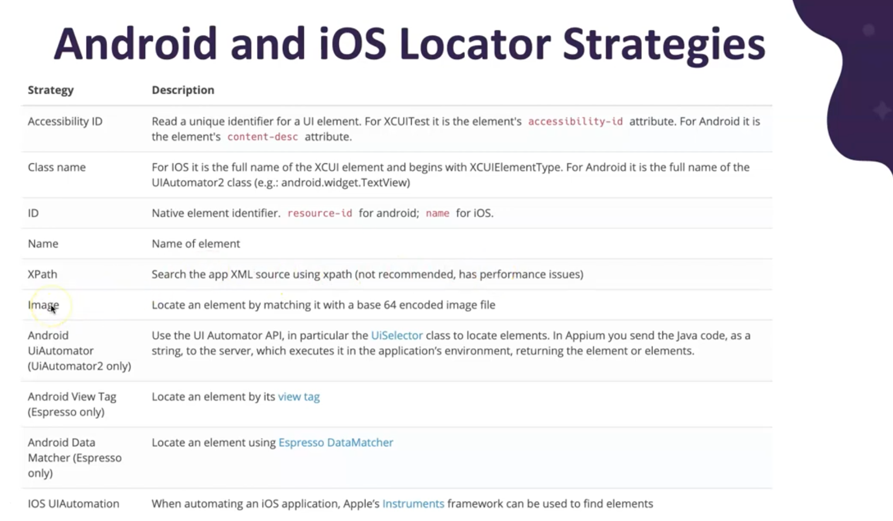
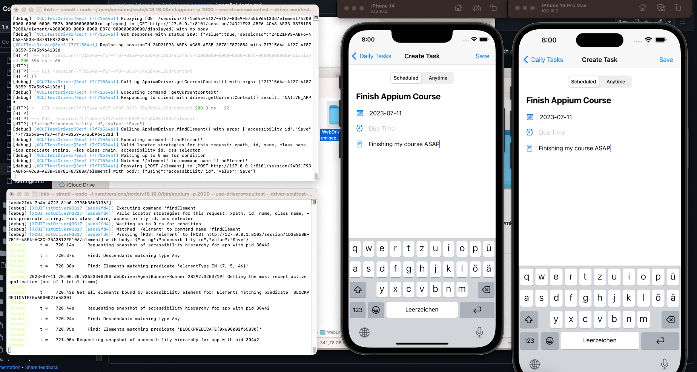
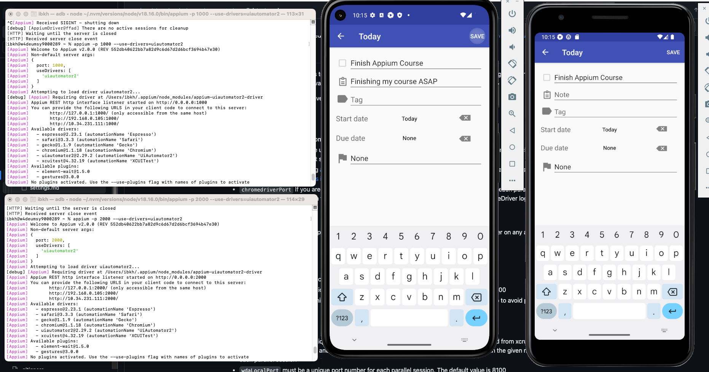

# Mobile Testing with Appium and Java

 This repo contains the code examples from the Test Automation University (TAU) courses by Moataz Nabil:
* [Mobile Testing with Appium and Java: From Setup to Execution](https://testautomationu.applitools.com/appium-java-tutorial-1/)
* [Mobile Testing with Appium and Java: Advanced Techniques](https://testautomationu.applitools.com/appium-java-tutorial-2/)
* [Course Repo](https://github.com/moatazeldebsy/Appium-TAU/tree/main)
* This repo has been extended to update the code to use Appium 2.0 and other design improvements to run tests with more
  flexibility and scalability. Coding examples do not completely follow the original course code, instead provide better
  assertions and testing strategies.

--

## Libraries and Tools

* Maven 3.9.2
* Java 11
* TestNG 7.8.0
* Cucumber Java 7.13
* Google GSON 2.10.1
* Appium Java client 8.5.1
* Appium server 2.0
    * drivers
        * uiautomator2@2.29.2
        * xcuitest@4.32.19
* Appium inspector 2023.5.2
* Maven surefire plugin 3.1.2
* [Appium doctor](https://github.com/appium/appium/tree/master/packages/doctor)
* Demo Apps
    * [DailyCheck](https://github.com/moatazeldebsy/Appium-TAU/blob/chapter11/apps/DailyCheck.zip)
    * [ToDo](https://github.com/moatazeldebsy/Appium-TAU/blob/chapter11/apps/ToDo.apk)
* Android Studio
    * Install android SDK with SDK Manager
        * Android 13.0
            * Android SDK Platform 33
            * Sources for Android 33
            * Google APIs Intel x86_64 Atom System Image (for Intel processors)
            * Google play Intel x86_64 Atom System Image (for Intel processors)
    * Setup Emulators with Virtual Device Manager
        * Pixel 5 with Android 13.0 Google Play | x86_64
        * Pixel 3a with Android 13.0 Google APIs | x86_64
* XCode 14.3 (with XCode commandline)
  * iPhone 14 iOS 16.2 Simulator
  * iPhone 14 Pro Max iOS 16.2 Simulator
* IntelliJ IDEA

--

## Notes

### Chapter 5 - Interacting with Elements

* Identifying UI Elements



* Simulating Sending SMS for Android 
  * The method for simulating SMS is only available for Android emulators as of now.
* Sending Photos for Android and iOS
* Automating Clipboard, Alerts, Picker View

### Chapter 7 - Page Object Design Pattern with Appium

* PageFactory by default is available only in the src/test/java because appium has included the selenium dependencies as run-time.
* To use the Page objects in src/java/main, include the corresponding selenium dependency separately in POM.xml


### Chapter 8 - Data-Driven Tests

* Google GSON library is used to parse json to java object array for data provider.

### Chapter 9 - BDD with Cucumber and Appium

* If you get error while executing the dummy feature, then delete the main.java and org.example package and main or app
  pre-generated test classes.Then right-click on the project root directory and build the project. If you change the
  folder paths or names, then also rebuild the project by right-clicking the project root directory. If the error
  persists, then Click on the Select Run/Debug configurations, and chose Edit Configuration. Change Build to
  Build-Project.
* If the steps and features are not under the same package name, then you have to specify the steps path with glue
  parameter and feature path with feature parameter.

### Chapter 10 - Appium Test Distribution - Parallel Tests

* [Parallel tests documentation](https://appium.readthedocs.io/en/stable/en/advanced-concepts/parallel-tests/)
* [Appium Parallel Execution Docs](https://github.com/appium/appium/blob/1.x/docs/en/advanced-concepts/parallel-tests.md)
* [Optimizing WebDriverAgent Startup Performance](https://www.headspin.io/blog/optimizing-webdriveragent-startup-performance)
* [Running Multiple Appium Tests in Parallel](https://www.headspin.io/blog/running-multiple-appium-tests-in-parallel)
* Make sure that the driver is thread local and not shared between multiple tests.
* Start the 2 iOS Simulators simultaneously from XCode. In this case, iPhone 14 and iPhone 14 Pro Max simulators with iOS 16.2
  are running in parallel.
* server specific flags can be found via: `appium server --help`
```
  --driver-xcuitest-webdriveragent-port WEBDRIVERAGENT_PORT
                        Local port used for communication with WebDriverAgent
  --driver-xcuitest-webkit-debug-proxy-port WEBKIT_DEBUG_PROXY_PORT
                        (Real device only) Port to which `ios-webkit-debug-proxy` is connected
```
* We need to start both appium servers on different ports and also change the port of WebDriverAgent in XCUITest Options.
  * `appium -p 1000 --use-drivers=xcuitest --driver-xcuitest-webdriveragent-port 8101` will start appium server on port 1000 with wda listening on port 8101 (default is 8100)
  * `appium -p 2000 --use-drivers=xcuitest --driver-xcuitest-webdriveragent-port 8102` will start appium server on port 1000 with wda listening on port 8102 (default is 8100)
* Overload the `ios_setup` method to accept device udid, WDA port, and appium server port from tests, and add the corresponding options.
* [Parallel Execution Maven surefire plugin](https://maven.apache.org/surefire/maven-surefire-plugin/examples/fork-options-and-parallel-execution.html)
* Create a separate profile for parallel test execution:
```xml
<profiles>
        <profile>
            <id>ios-parallel</id>
            <build>
                <plugins>
                    <plugin>
                        <groupId>org.apache.maven.plugins</groupId>
                        <artifactId>maven-surefire-plugin</artifactId>
                        <version>${maven.surefire.version}</version>
                        <configuration>
                            <parallel>methods</parallel>
                            <threadCount>4</threadCount>
                            <suiteXmlFiles>
                                <suiteXmlFile>test-suites/parallel-suite.xml</suiteXmlFile>
                            </suiteXmlFiles>
                        </configuration>
                    </plugin>
                </plugins>
            </build>
        </profile>
    </profiles>
```
* The tests should look like this:
```java
public class IOSParallelTest extends ParallelBaseTest {
    CreateTaskPage createTaskPage;
    TasksListPage tasksListPage;

    @Test
    public void test_add_task1() {
        //Start appium server with
        //appium -p 1000 --use-drivers=xcuitest --driver-xcuitest-webdriveragent-port 8101
        iOS_Setup("1000", PropertyUtils.getDeviceProp("IOS_UDID"), 8101);
        tasksListPage = new TasksListPage(getDriver());
        .......
    }

    @Test
    public void test_add_task2() {
        //Start appium server with
        //appium -p 2000 --use-drivers=xcuitest --driver-xcuitest-webdriveragent-port 8102
        iOS_Setup("2000", PropertyUtils.getDeviceProp("IOS_UDID_2"), 8102);
        tasksListPage = new TasksListPage(getDriver());
        .....
    }
}
```
* Run your iOS tests in parallel with cmd `mvn test -P ios-parallel`
* Alternatively, you can also run TestNG tests in parallel with IntelliJ by
  adding `-parallel methods -threadcount 4 -dataproviderthreadcount 4` in the "Test runner params" field of TestNG run
  configuration under "JDK Settings".
* If WebDriverAgent is not getting installed on the device/simulator, then:
  * [bug: Appium fails to install WDA on apple tv 4k. #17896](https://github.com/appium/appium/issues/17896)
  * [iOS parallel test on ingle appium server #12921](https://github.com/appium/appium/issues/12921)
  * Download the latest release of Webdriver agent and replace it in WebDriverAgent folder.[Unable to launch WebDriverAgent because of xcodebuild failure: xcodebuild failed with code 65](https://stackoverflow.com/questions/44159951/unable-to-launch-webdriveragent-because-of-xcodebuild-failure-xcodebuild-failed)
  * try it manually with following command. 
    * Just replace the id with UDID of the device or simulator, 
    * and adjust deployment target according to platform version.
    * and the derived path can be found from the logs of appium tests as well.
```text
xcodebuild build-for-testing test-without-building -project /Users/ibkh/.appium/node_modules/appium-xcuitest-driver/node_modules/appium-webdriveragent/WebDriverAgent.xcodeproj -scheme WebDriverAgentRunner -destination id=1E8FE39B-1118-4117-B02B-66A390AECB3F IPHONEOS_DEPLOYMENT_TARGET=16.2 GCC_TREAT_WARNINGS_AS_ERRORS=0 COMPILER_INDEX_STORE_ENABLE=NO
```



* Similarly, you can also run the tests in parallel on android devices. This time you have to provide uiautomator2 driver
  system port differently for both the tests.
* Start the corresponding Android Emulators and make sure to verify the udid of the emulators via `adb devices`
* If android emulator is giving the error titled "System UI isn't responding", then:
  * Open AVD Manager.
  * Click to edit button for your device.
  * Select Hardware in the Graphics drop down menu.
  * Save settings and cold boot the emulator.
*  Start the 2 appium servers with:
  * `appium -p 1000 --use-drivers=uiautomator2`
  * and
  * `appium -p 2000 --use-drivers=uiautomator2`
* Run your android tests in parallel with `mvn test -P android-parallel`



### Chapter 11 - Continuous Integration with GitHub Actions

* [GitHub Actions documentation](https://docs.github.com/en/actions)
* [Using workflows](https://docs.github.com/en/actions/using-workflows)
* [GitHub Action - Android Emulator Runner](https://github.com/marketplace/actions/android-emulator-runner)


--

## Running Tests

* Start the android emulator and iOS simulators and configure the device UDIDs in config.properties located at src/test/resources.
* Start the appium server `appium --use-drivers=uiautomator2,xcuitest`
  * If you want to execute a single test class, then execute the command `mvn test -Dtest=”TestClassName”`
    * e.g. `mvn clean test -Dtest="ToDoAndroidTest"` will run todoapp test for android.
    * e.g. `mvn clean test -Dtest="ToDoIOSTest"` will run todoapp test for iOS.
  * For running a specific set of test cases, execute profiles configured with suite xml files:
    * e.g. `mvn clean test -P todo` will run the test cases for todoapp from ToDosAppSuite.xml
    * e.g. `mvn clean test -P interactions` will run the appium native interactions commands from AppiumInteractionsSuite.xml
* For running tests in parallel on 2 devices,  start the appium server on different ports:
  * For Android:
    * Setup 2 emulators in parallel and configure UDIDs in config.properties 
    * Start 2 appium servers separately with `appium -p 1000 --use-drivers=uiautomator2` and `appium -p 2000 --use-drivers=uiautomator2`
    * Run your android tests in parallel with `mvn test -P android-parallel`
  * For iOS:
    * Setup 2 simulators in parallel and configure UDIDs in config.properties
    * Start 2 appium servers each listening to different WDA port:
      * `appium -p 1000 --use-drivers=xcuitest --driver-xcuitest-webdriveragent-port 8101` will start appium server on port 1000 with wda listening on port 8101 (default is 8100)
      * `appium -p 2000 --use-drivers=xcuitest --driver-xcuitest-webdriveragent-port 8102` will start appium server on port 1000 with wda listening on port 8102 (default is 8100)
    * Run your iOS tests in parallel with cmd `mvn test -P ios-parallel`
* Alternatively, you can simply run the tests with IntelliJ IDE for testing purposes instead of command line.
* 


