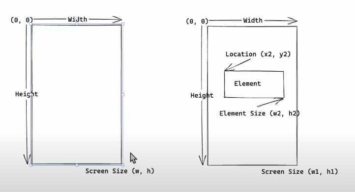

# Appium Tutorials by Wasiq Bhamla

* [Appium Tutorials](https://www.youtube.com/playlist?list=PLdZJM6yxhZyTKa7l6J5MVnJv663Wd5D3y)
* [Beginners Guide to Appium](https://www.youtube.com/playlist?list=PLdZJM6yxhZySIufG_a_NQM9NWSvOVeAA4)
* [Appium Tips](https://www.youtube.com/playlist?list=PLdZJM6yxhZySpolLYlBl09Q5uoXEagOfO)
* [W3C Actions](https://www.w3.org/TR/webdriver/#actions)
*  
---

## Libraries and Tools

* Maven 3.9.2
* Java 11
* TestNG 7.8.0
* Selenium 4.9.1
* Appium Java client 8.5.1
* Appium server 2.0.0-beta.71
    * drivers
        * uiautomator2@2.25.2
        * xcuitest@4.30.2
    * plugins
        * element-wait@1.5.0
        * gestures@2.1.0
* Appium inspector 2023.5.2
* Lombok 1.18.28
* Google Truth 1.1.4
* Google Guava 32.0.1-jre
* [Appium doctor](https://github.com/appium/appium/tree/master/packages/doctor)
* Demo Apps
    * [Sauce Labs My Demo App React Native (2022 version)](https://github.com/saucelabs/sample-app-mobile)
    * [WDIO Native Demo App](https://github.com/webdriverio/native-demo-app/releases)
* Android Studio
    * Install android SDK with SDK Manager
        * Android 13.0
            * Android SDK Platform 33
            * Sources for Android 33
            * Google APIs Intel x86_64 Atom System Image (for Intel processors)
            * Google play Intel x86_64 Atom System Image (for Intel processors)
    * Setup Emulators with Virtual Device Manager
        * Pixel 5 with Android 13.0 Google Play | x86_64
* XCode 14.3 (with XCode commandline)
* IntelliJ IDEA

---

## Project Boilerplate Design Patterns

### Lombok

* The `AppiumServiceManager` and `AndroidDriverManager` and `IOSDriverManager` use the lombok Builder annotation to
  create instance of classes with builder pattern.
* [Project Lombok Builder](https://projectlombok.org/features/Builder)
* [Lombok builder API javadoc](https://projectlombok.org/api/lombok/Builder)
* [Lombok builder javadoc](https://www.javadoc.io/doc/org.projectlombok/lombok/latest/lombok/Builder.html)
* [Intro to lombok - Baeldung](https://www.baeldung.com/intro-to-project-lombok)
* [lombok builder - Baeldung](https://www.baeldung.com/lombok-builder)
* `@Builder` annotation creates a so-called 'builder' aspect to the class that is annotated.
* `builderMethodName` Name of the static method that creates a new builder instance.
* `buildMethodName` Name of the instance method in the builder class that creates an instance of your @Builder-annotated
  class.
* The above annotations help us to build the instance of class with custom parameters specific to the test case.
* `Builder.default` The field annotated with @Default must have an initializing expression; that expression is taken as
  the default to be used if not explicitly set during building.
* `@AllArgsConstructor` Generates an all-args constructor. An all-args constructor requires one argument for every field
  in the class.

### Driver Manager Interface

* Since the android and iOS needs to initialize driver differently i.e. for android new AndroidDriver() and for iOS new
  IOSDriver(), both these are child classes of AppiumDriver.
* Therefore, we implemented a generic interface `IDriverManager` that the classes `AndroidDriverManager`
  and `IOSDriverManager` implements accordingly to the platform for test case application.
* The `getDriver()` method is overridden in implementation classes to return the new driver instance as per the platform
  with the platform specific capabilities.
* Before and After TestNG Hooks are where the driver is initialized and shut down.
* Waits and Gesture Utils are also initialized for the particular test class in Before Hook.

### Miscellaneous

* `Path.of (USER_DIR, MessageFormat.format ("src/test/resources/apps/{0}.app.zip", this.appName)` Returns a Path by
  converting a path string, or a sequence of strings that when joined form a path string.
* `MessageFormat` takes a set of objects, formats them, then inserts the formatted strings into the pattern at the
  appropriate places.
*

---

## Gestures



### Swipe Till an Element is Visible

* There are following ways in which this gesture is implemented:
#### Using W3C Actions and Sequence Class
**Test Method**
```java
    final var maxSwipe = 5;
    var swipeCount = 0;
    while (SwipePage.isNotDisplayed (swipePage.getPlainLogo (), this.wait) && swipeCount++ < maxSwipe) {
        this.fingerGesture.swipe (FingerGestureUtils.Direction.UP, 70);
    }
```
**Gesture Utils**
 ```java
     //Performs the swipe gesture in given direction with provided distance
    //This method is overloaded in case we want to swipe from the middle of screen, the element is null
    public void swipe(final Direction direction, final int distance) {
            swipe(direction, null, distance);
    }
    
    //Performs the swipe gesture from the middle of element in given direction with given distance
    //Calculates the swipe start and end points based on element/screen and pass to singleFingerSwipe()
    public void swipe(final Direction direction, final WebElement element, final int distance) {
        final var start = getSwipeStartPosition(element);
        final var end = getSwipeEndPosition(direction, element, distance);
    
        System.out.println("Swipe.....");
        if (element != null) {
        printDimension("Element Size: ", element.getSize());
        printPoint("Element location: ", element.getLocation());
        }
        printPoint("Start: ", start);
        printPoint("End: ", end);
    
        final var sequence = singleFingerSwipe(FINGER_1, 0, start, end);
        this.driver.perform(singletonList(sequence));
    }
    
    //Returns the sequence of actions for swipe or tap based on start and end point
    private Sequence singleFingerSwipe(final String fingerName, final int index, final Point start, final Point end) {
        final var finger = new PointerInput(PointerInput.Kind.TOUCH, fingerName);
        final var sequence = new Sequence(finger, index);
        
        sequence.addAction(finger.createPointerMove(Duration.ZERO, PointerInput.Origin.viewport(), start.getX(), start.getY()));
        sequence.addAction(finger.createPointerDown(PointerInput.MouseButton.LEFT.asArg()));
        
        if (end != null) {
        sequence.addAction(new Pause(finger, Duration.ofMillis(500)));
        sequence.addAction(finger.createPointerMove(Duration.ofMillis(500), PointerInput.Origin.viewport(), end.getX(), end.getY()));
        }
        
        sequence.addAction(finger.createPointerUp(PointerInput.MouseButton.LEFT.asArg()));
        
        return sequence;
    }
```
    
#### Using executeScript() methods
```java
    //We pass the id of the scroll element/screen and the target element strategy and selector to executeScript()
    final var args = new HashMap<String, Object>();
    args.put("elementId", ((RemoteWebElement) scrollView).getId());
    args.put("strategy", "accessibility id");
    args.put("selector", "WebdriverIO logo");
    this.driver.executeScript("mobile: scroll",args);
```
    
#### Using UiScrollable scrollIntoView() method from Android UIAutomator2
````java
    private final By scrolledLogo = AppiumBy.androidUIAutomator(
        "new UiScrollable(new UiSelector().scrollable(true)).scrollIntoView(new UiSelector().description(\"WebdriverIO logo\"))"
        );
    
    //automatically scrolls to the element because the locator uses UiScrollable scrollIntoView method
    final var logo = this.wait.until (visibilityOfElementLocated (swipePage.getScrolledLogo ()));
    assertThat (logo.isDisplayed ()).isTrue ();
````

### Tap/ Click

* tap gesture is achieved with the help of reusable `singleFingerSwipe()` with end coordinates passed as null.
```java
    //Performs the tap on screen element
    //Ending coordinates are passed as null for singleFingerSwipe so it will only move to start point, press, and lift finger
    public void tap(final WebElement element) {
        final var start = getElementCenter(element);
        final var sequence = singleFingerSwipe(FINGER_1, 0, start, null);

        this.driver.perform(singletonList(sequence));   //perform method requires a collection of sequence
    }
```

### Swipe

### Drag and Drop

### Zoom in and Zoom out

---

## Tips

* Traversing through the generated XML in Appium Inspector can be cumbersome. To reduce the XML to important nodes:
    * Go to the commands tab, choose Session and Settings, and click on Update Settings
    * Add the following text to settingsJson field `{"ignoreUnimportantViews": true}`
    * If the result of the command is null, then this means command is successfully applied
    * Go to the source tab, and click refresh. This enables finding of the elements to be much faster
* Alternatively you can also supply above settings as capability before starting the session:
    * add the `settings(ignoreUnimportantViews): true` as capability and start the sessoion.
* To avoid dealing with the permissions popup, add this capability `autoGrantPermissions: true`
* Right Click on app file and click `Copy <File Name> a sPathname` to copy the path of file
* Enter the command in terminal `emulator -list-avds` to get the name of virtual device emulators
* Supply this device name as `avd` property which will automatically start the emulator and you do not need to start it
  manually
